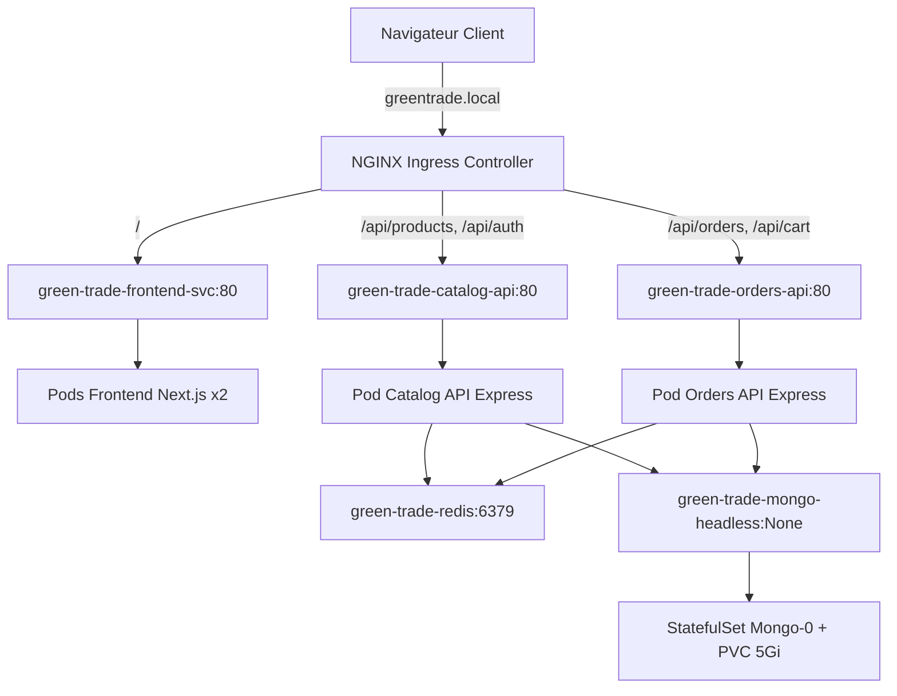

## 🏗️ Architecture du Socle Kubernetes (Section B)

L'ensemble de l'infrastructure de Green Trade est orchestré dans un Namespace dédié nommé `green-trade` afin de garantir l'isolation des ressources.



### Composants applicatifs (Deployments)

Nous avons déployé 3 microservices sans état (stateless) hautement disponibles :

- `green-trade-frontend` (Next.js) : Configuré avec 2 réplicas pour assurer la haute disponibilité.

- `green-trade-catalog-api` & `green-trade-orders-api` (Express.js) : Microservices gérant la logique métier.

Chaque déploiement intègre les bonnes pratiques de production suivantes :

- Stratégie de mise à jour (RollingUpdate) : Configurée avec `maxSurge: 1` et `maxUnavailable: 0`. Cela garantit qu'un nouveau pod est démarré et validé comme sain avant qu'un ancien ne soit éteint. Aucun downtime pour l'utilisateur.

- Gestion des ressources (Requests & Limits) : Limitation stricte de l'usage CPU/Mémoire pour éviter qu'un conteneur défaillant ne sature le nœud de calcul (Exemple Frontend : Requests: 100m CPU / 256Mi RAM ; Limits: 500m CPU / 512Mi RAM).

- Sondes de santé (Probes) :

    - `livenessProbe` : Interroge l'application régulièrement pour vérifier qu'elle n'est pas bloquée. Si elle échoue, Kubernetes recrée le conteneur.

    - `readinessProbe` : S'assure que l'application est prête à recevoir du trafic réseau réel (notamment après l'initialisation des connexions aux bases de données) avant de la connecter à l'Ingress.

### Composant de données (StatefulSet)

La persistance des données de MongoDB est gérée via un StatefulSet (`green-trade-mongo`) associé à un VolumeClaimTemplate (PVC) de 5Gi provisionné de manière dynamique.

- Service Headless (`green-trade-mongo-headless`) : Configuré avec `clusterIP: None` pour permettre à Prisma d'accéder individuellement au pod de base de données, ce qui est indispensable pour initialiser et gérer le Replica Set MongoDB (`rs0`).

## Guide de Déploiement

Prérequis

- Un cluster Kubernetes local fonctionnel (ex: Minikube sur Mac).

- L'addon Ingress activé (`minikube addons enable ingress`).

- Le tunnel réseau ouvert pour l'exposition (`minikube tunnel`).

### Étapes d'installation
Appliquez les manifestes dans l'ordre de dépendance des ressources :

```bash
# 1. Création de l'isolation réseau
kubectl apply -f k8s/deployments/namespace.yaml

# 2. Configuration et secrets (Variables d'environnement et DATABASE_URL)
kubectl apply -f k8s/deployments/configmap.yaml

# 3. Déploiement du stockage et de l'infrastructure de données (MongoDB, Redis)
kubectl apply -f k8s/deployments/mongo-services.yaml
kubectl apply -f k8s/deployments/mongo-statefulset.yaml
kubectl apply -f k8s/deployments/redis-deployment.yaml

# 4. Déploiement des microservices applicatifs
kubectl apply -f k8s/deployments/backend-deployment.yaml
kubectl apply -f k8s/deployments/frontend-deployment.yaml

# 5. Configuration du routage réseau Ingress
kubectl apply -f k8s/deployments/ingress.yaml
```

### Initialisation de la base de données (Prisma)
Une fois que tous les pods sont au statut Running, synchronisez le schéma Prisma avec MongoDB :

```bash
# Récupérer le nom du pod backend-catalog
kubectl get pods -n green-trade

# Executer la synchronisation
kubectl exec -it <NOM_POD_CATALOG_API> -n green-trade -- npx prisma@6 db push
```
