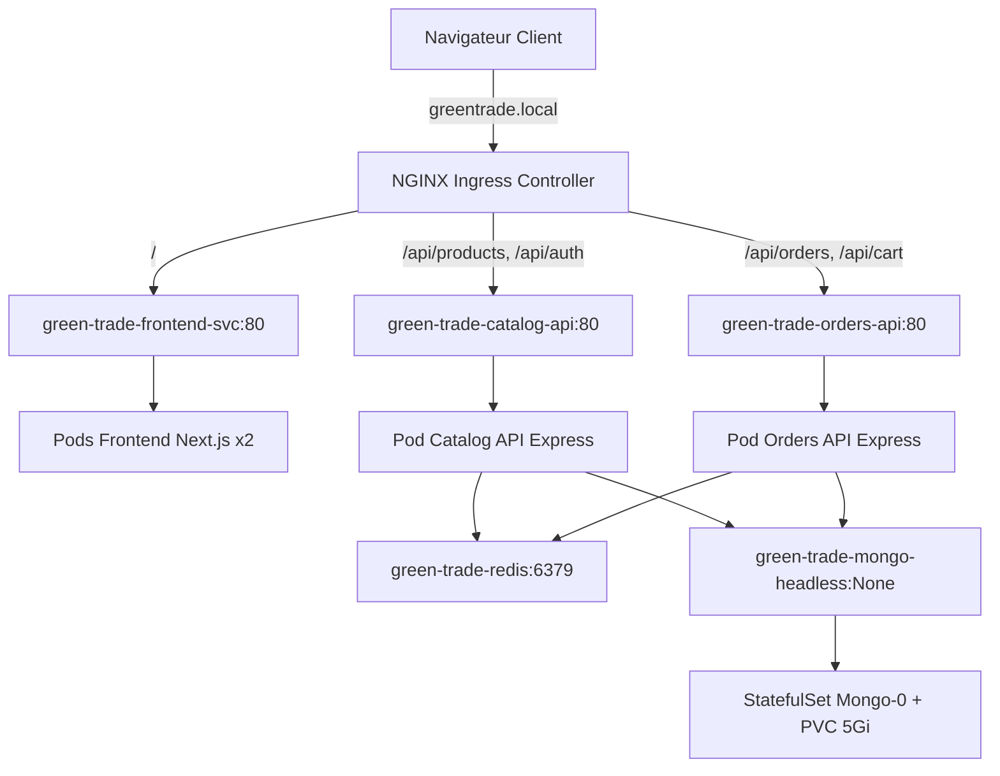

## 🏗️ Architecture du Socle Kubernetes (Section B)

L'ensemble de l'infrastructure de Green Trade est orchestré dans un Namespace dédié nommé `green-trade` afin de garantir l'isolation des ressources.



### Composants applicatifs (Deployments)

Nous avons déployé 3 microservices sans état (stateless) hautement disponibles :

- `green-trade-frontend` (Next.js) : Configuré avec 2 réplicas pour assurer la haute disponibilité.

- `green-trade-catalog-api` & `green-trade-orders-api` (Express.js) : Microservices gérant la logique métier.

Chaque déploiement intègre les bonnes pratiques de production suivantes :

- Stratégie de mise à jour (RollingUpdate) : Configurée avec `maxSurge: 1` et `maxUnavailable: 0`. Cela garantit qu'un nouveau pod est démarré et validé comme sain avant qu'un ancien ne soit éteint. Aucun downtime pour l'utilisateur.

- Gestion des ressources (Requests & Limits) : Limitation stricte de l'usage CPU/Mémoire pour éviter qu'un conteneur défaillant ne sature le nœud de calcul (Exemple Frontend : Requests: 100m CPU / 256Mi RAM ; Limits: 500m CPU / 512Mi RAM).

- Sondes de santé (Probes) :

    - `livenessProbe` : Interroge l'application régulièrement pour vérifier qu'elle n'est pas bloquée. Si elle échoue, Kubernetes recrée le conteneur.

    - `readinessProbe` : S'assure que l'application est prête à recevoir du trafic réseau réel (notamment après l'initialisation des connexions aux bases de données) avant de la connecter à l'Ingress.

### Composant de données (StatefulSet)

La persistance des données de MongoDB est gérée via un StatefulSet (`green-trade-mongo`) associé à un VolumeClaimTemplate (PVC) de 5Gi provisionné de manière dynamique.

- Service Headless (`green-trade-mongo-headless`) : Configuré avec `clusterIP: None` pour permettre à Prisma d'accéder individuellement au pod de base de données, ce qui est indispensable pour initialiser et gérer le Replica Set MongoDB (`rs0`).

## Guide de Déploiement

Prérequis

- Un cluster Kubernetes local fonctionnel (ex: Minikube sur Mac).

- L'addon Ingress activé (`minikube addons enable ingress`).

- L'addon metrics-server activé (`minikube addons enable metrics-server`) — indispensable pour le HPA et `kubectl top`.

- Le tunnel réseau ouvert pour l'exposition (`minikube tunnel`).

### Étapes d'installation
Appliquez les manifestes dans l'ordre de dépendance des ressources :

```bash
# 1. Création de l'isolation réseau
kubectl apply -f k8s/deployments/namespace.yaml

# 2. Configuration et secrets (Variables d'environnement et DATABASE_URL)
kubectl apply -f k8s/deployments/configmap.yaml
kubectl apply -f k8s/secrets/secrets.yaml

# 3. Déploiement du stockage et de l'infrastructure de données (MongoDB, Redis)
kubectl apply -f k8s/deployments/mongo-services.yaml
kubectl apply -f k8s/deployments/mongo-statefulset.yaml
kubectl apply -f k8s/deployments/redis-deployment.yaml
kubectl apply -f k8s/deployments/redis-service.yaml

# 4. Déploiement des microservices applicatifs
kubectl apply -f k8s/deployments/catalog-deployment.yaml
kubectl apply -f k8s/deployments/catalog-service.yaml
kubectl apply -f k8s/deployments/orders-deployment.yaml
kubectl apply -f k8s/deployments/orders-service.yaml
kubectl apply -f k8s/deployments/frontend-service.yaml
kubectl apply -f k8s/deployments/frontend-deployment.yaml

# 5. Configuration du routage réseau Ingress
kubectl apply -f k8s/deployments/ingress.yaml

# 6. Scalabilité & observabilité (HPA + ServiceMonitor + alertes)
#    Le ServiceMonitor/PrometheusRule nécessitent kube-prometheus-stack (cf. Runbook §3.1).
kubectl apply -f k8s/observability/
```

### Initialisation de la base de données (Prisma)
Une fois que tous les pods sont au statut Running, synchronisez le schéma Prisma avec MongoDB :

```bash
# Récupérer le nom du pod backend-catalog
kubectl get pods -n green-trade

# Executer la synchronisation
kubectl exec -it <NOM_POD_CATALOG_API> -n green-trade -- npx prisma@6 db push
```

---

## 📈 Scalabilité et résilience

Le service backend-api `green-trade-catalog-api` est déployé avec **2 replicas minimum** et géré par un **Horizontal Pod Autoscaler (HPA)** basé sur la métrique CPU (seuil de 50%).
Les requêtes CPU (`resources.requests.cpu`) sont définies à `200m` pour permettre au HPA de prendre des décisions cohérentes basées sur les métriques du `metrics-server`.

Commandes de vérification :
```bash
# Consulter l'état du HPA
kubectl get hpa -n green-trade

# Suivre la charge CPU/Mémoire des pods en direct
kubectl top pods -n green-trade
```

Un scénario de résilience (self-healing) est assuré en direct par la suppression manuelle d'un pod backend. Le Deployment recrée automatiquement le pod supprimé, tandis que le Service maintient la continuité de service en redirigeant le trafic vers le replica actif restant.

Un script `k8s/observability/loadtest.sh` automatise les deux preuves de la démo :
```bash
# Montée en charge -> déclenche le scale-up du HPA (observer `kubectl get hpa`)
./k8s/observability/loadtest.sh load

# Sonde de dispo pendant 30s : tuer un pod dans un autre terminal, le script mesure le % d'indisponibilité
./k8s/observability/loadtest.sh resilience 30

# Nettoyer les générateurs de charge
./k8s/observability/loadtest.sh clean
```

---

## 📊 Observabilité

L’observabilité repose sur trois niveaux clés :

1. **Logs applicatifs JSON** : Formatés automatiquement en JSON structuré lorsque la variable `LOG_FORMAT=json` est active. Consultables en ligne de commande :
   ```bash
   kubectl logs -n green-trade deployment/green-trade-catalog-api --tail=50
   ```
2. **Métriques Kubernetes** : Suivi direct de la consommation de ressources avec `kubectl top pods/nodes`.
3. **Monitoring complet (Prometheus & Grafana)** :
   * L'application expose un endpoint compatible `/metrics` collectant l'uptime, l'usage mémoire et le compte des requêtes par route/statut.
   * Un `ServiceMonitor` Kubernetes permet à Prometheus de découvrir et de scraper automatiquement cet endpoint toutes les 15 secondes.
   * Une règle d'alerte `PrometheusRule` déclenche une alerte critique si aucun replica backend n'est disponible pendant plus d'une minute ou si la charge CPU d'un pod dépasse 80% pendant plus de 5 minutes.

Le port-forward pour accéder à Grafana et suivre les tableaux de bord se fait par :
```bash
kubectl port-forward svc/monitoring-grafana 3001:80 -n monitoring
```

---

## 🔒 Sécurité

La sécurité du cluster est garantie par plusieurs couches de protection conformes aux meilleures pratiques Kubernetes :

### Contrôle d'Accès (RBAC)

Un `ServiceAccount` dédié `green-trade-app` est utilisé par tous les pods. Ce compte est associé à un `Role` avec des permissions minimales et restreintes au namespace `green-trade`. Les permissions autorisées incluent uniquement :
- Lire les pods et leurs logs (`get`, `list`, `watch` sur ressources `pods` et `pods/log`)
- Lire les configurations (`get`, `list` sur ressources `configmaps`)
- Lire les secrets (`get`, `list` sur ressources `secrets`)

Cette approche suit le principe du **moindre privilège** : aucun pod n'a accès cluster-wide, et les permissions sont strictement scopées au namespace. Le fichier de configuration se trouve dans `k8s/security/rbac.yaml`.

```bash
# Vérifier le ServiceAccount et les permissions
kubectl get serviceaccount -n green-trade
kubectl get role -n green-trade
kubectl get rolebinding -n green-trade
```

### Isolation Réseau (NetworkPolicy)

Par défaut, tous les pods sont en communication directe. Une `NetworkPolicy` avec stratégie **deny-all** est appliquée au namespace, suivie d'autorisations explicites pour les flux de trafic légitimes :

- **Ingress → Frontend** : Le contrôleur NGINX Ingress peut envoyer du trafic au port 3000 du Frontend.
- **Frontend → APIs** : Le Frontend accède aux APIs Catalog et Orders sur le port 4000.
- **APIs → Bases de données** : Les APIs accèdent à MongoDB (port 27017) et Redis (port 6379).
- **DNS** : Tous les pods peuvent faire des requêtes DNS (UDP/TCP port 53) pour la résolution de noms.

Cette approche empêche tout trafic non autorisé (par exemple, une API ne peut pas accéder directement à MongoDB sans passer par le pod applicatif). Les policies se trouvent dans `k8s/security/network-policy.yaml`.

```bash
# Vérifier les NetworkPolicies
kubectl get networkpolicy -n green-trade
kubectl describe networkpolicy allow-ingress-to-frontend -n green-trade
```

### Restrictions de Sécurité des Pods (PodSecurity & SecurityContext)

Tous les pods sont configurés avec un `securityContext` strict appliqué au niveau du Deployment/StatefulSet :

- **`runAsNonRoot: true`** : Refuse d'exécuter les processus en tant que root (UID 0). Les processus tournent avec des UIDs non-privilégiés (1000 ou 999).
- **`allowPrivilegeEscalation: false`** : Empêche un processus de gains de privilèges via `setuid` ou `setgid`.
- **`seccompProfile: RuntimeDefault`** : Applique le profil seccomp par défaut du runtime pour restreindre les appels système dangereux.
- **`capabilities.drop: ["ALL"]`** : Supprime toutes les capabilities Linux (namespaces, fichiers bruts, etc.) sauf les strictement nécessaires.

Au niveau du Namespace, le label `pod-security.kubernetes.io/enforce: restricted` applique des vérifications strictes lors du déploiement de nouveaux pods. Tout pod ne respectant pas cette politique est rejeté.

```bash
# Vérifier les labels de sécurité du namespace
kubectl get namespace green-trade -o yaml | grep pod-security

# Vérifier le securityContext d'un pod
kubectl get pod <POD_NAME> -n green-trade -o jsonpath='{.spec.securityContext}'
```

### Gestion des Secrets

Les données sensibles (DATABASE_URL, clés API, etc.) sont stockées dans un `Secret` Kubernetes plutôt que dans le code source. Le fichier template `k8s/secrets/secrets.example.yaml` illustre la structure attendue (sans valeurs réelles).

**Procédure de création des secrets :**

```bash
# 1. Dupliquer le template
cp k8s/secrets/secrets.example.yaml k8s/secrets/secrets.yaml

# 2. Remplir les valeurs réelles dans secrets.yaml (ne pas committer ce fichier)
# Ajouter secrets.yaml à .gitignore pour éviter les leaks accidentels
echo "k8s/secrets/secrets.yaml" >> .gitignore

# 3. Appliquer le secret
kubectl apply -f k8s/secrets/secrets.yaml

# 4. Vérifier que le secret a été créé
kubectl get secrets -n green-trade
kubectl describe secret green-trade-secrets -n green-trade
```

**Important** : Le fichier `secrets.yaml` contenant les vraies valeurs **ne doit jamais** être commité au repository. Seul le template `secrets.example.yaml` est versionné.

